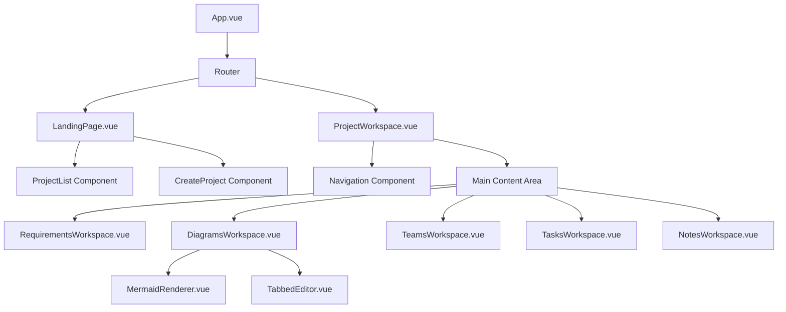

# Design Document

## Overview

The SO Assistant transformation involves restructuring the existing "Code To Diagram" application into a comprehensive project management system. The design introduces a two-page architecture: a landing page for project selection/creation and a project workspace with multi-section navigation. This maintains existing diagram functionality while adding requirements management, teams, tasks, and notes capabilities.

## Architecture

### High-Level Architecture



### Page Structure

1. **Landing Page** (`/`)
   - Project list with title and description
   - Inline project creation form
   - Navigation to selected project workspace

2. **Project Workspace** (`/project/:id`)
   - Navigation sidebar with 5 sections
   - Dynamic main content area
   - Project context maintained across sections

## Components and Interfaces

### New Components

#### 1. LandingPage.vue
- **Purpose**: Entry point for project selection and creation
- **Key Features**:
  - Display list of existing projects with title/description
  - Inline project creation form (no dialog)
  - Project selection navigation
- **Props**: None
- **Emits**: None
- **State**: 
  - `availableProjects: Project[]`
  - `isLoading: boolean`
  - `newProject: { id: string, name: string, description: string }`

#### 2. ProjectWorkspace.vue (Refactored)
- **Purpose**: Main project workspace with navigation
- **Key Features**:
  - Navigation sidebar with 5 sections
  - Dynamic content area
  - Project context management
- **Props**: `projectId: string`
- **Emits**: None
- **State**:
  - `currentProject: Project`
  - `activeSection: string`
  - `isLoading: boolean`

#### 3. DiagramsWorkspace.vue
- **Purpose**: Extracted diagram functionality from current ProjectWorkspace
- **Key Features**:
  - Diagram list and management
  - Tabbed editor interface
  - Mermaid rendering
- **Props**: `project: Project`
- **Emits**: `project-updated`
- **State**: Same as current ProjectWorkspace diagram-related state

#### 4. RequirementsWorkspace.vue
- **Purpose**: Requirements management with file upload
- **Key Features**:
  - File upload area for requirement generation
  - Editable requirements list
  - Backend integration for file processing
- **Props**: `project: Project`
- **Emits**: `requirements-updated`
- **State**:
  - `requirements: Requirement[]`
  - `uploadedFiles: File[]`
  - `isProcessing: boolean`

#### 5. Placeholder Components
- **TeamsWorkspace.vue**: "Teams functionality coming soon"
- **TasksWorkspace.vue**: "Tasks functionality coming soon" 
- **NotesWorkspace.vue**: "Notes functionality coming soon"

### Modified Components

#### App.vue Updates
- Replace "Code To Diagram" with "SO Assistant" in header
- Add Vue Router for page navigation
- Remove direct ProjectWorkspace mounting

#### Router Configuration
```javascript
const routes = [
  { path: '/', component: LandingPage },
  { path: '/project/:id', component: ProjectWorkspace, props: true }
]
```

## Data Models

### Enhanced Project Interface
```typescript
interface Project {
  id: string
  name: string
  description: string
  createdAt: Date
  lastModified: Date
  diagrams: Diagram[]
  requirements: Requirement[]
  teams: Team[]
  tasks: Task[]
  settings: ProjectSettings
  metadata: ProjectMetadata
}
```

### New Requirement Interface
```typescript
interface Requirement {
  id: number
  description: string
  category: 'Functional' | 'Non-Functional'
  source?: 'uploaded' | 'manual'
  createdAt: Date
  updatedAt: Date
}
```

### File Upload Interface
```typescript
interface UploadedFile {
  id: string
  name: string
  size: number
  type: string
  content: string | ArrayBuffer
  uploadedAt: Date
}
```

## Error Handling

### File Upload Error Handling
- **File Size Limits**: Maximum 10MB per file
- **File Type Validation**: Accept .txt, .md, .pdf, .docx
- **Processing Errors**: Display user-friendly messages for backend failures
- **Network Errors**: Retry mechanism with exponential backoff

### Navigation Error Handling
- **Invalid Project ID**: Redirect to landing page with error message
- **Project Load Failures**: Show error state with retry option
- **Section Load Failures**: Fallback to previous working section

### State Management Errors
- **Project Context Loss**: Automatic recovery from localStorage
- **Unsaved Changes**: Warning dialogs before navigation
- **Concurrent Modifications**: Conflict resolution UI

## Testing Strategy

### Unit Testing
- **Component Testing**: Vue Test Utils for all new components
- **Service Testing**: Mock backend services for file upload and requirements processing
- **Utility Testing**: Validation functions and data transformations

### Integration Testing
- **Navigation Flow**: Landing page to project workspace transitions
- **File Upload Flow**: End-to-end file processing workflow
- **Project Management**: Create, select, and switch between projects

### E2E Testing
- **User Journeys**: Complete workflows from landing to project work
- **Cross-Browser**: Chrome, Firefox, Safari compatibility
- **Responsive Design**: Mobile and desktop layouts

### Test Scenarios
1. **Landing Page**:
   - Load existing projects
   - Create new project with validation
   - Navigate to project workspace

2. **Project Workspace**:
   - Navigation between sections
   - Project context preservation
   - Error state handling

3. **Requirements Management**:
   - File upload and processing
   - Requirements list editing
   - Backend integration

4. **Diagrams Integration**:
   - Existing diagram functionality
   - Tab management
   - Save/load operations

## Implementation Phases

### Phase 1: Core Structure
- Create router configuration
- Implement LandingPage.vue
- Refactor App.vue for routing
- Update branding to "SO Assistant"

### Phase 2: Project Workspace
- Create new ProjectWorkspace.vue with navigation
- Extract DiagramsWorkspace.vue from existing code
- Implement navigation state management

### Phase 3: Requirements Management
- Create RequirementsWorkspace.vue
- Implement file upload functionality
- Add backend integration for file processing
- Create editable requirements list

### Phase 4: Placeholder Sections
- Create Teams, Tasks, Notes placeholder components
- Implement consistent styling and project context

### Phase 5: Integration & Testing
- End-to-end testing
- Performance optimization
- Error handling refinement
- Documentation updates

## Security Considerations

### File Upload Security
- **File Type Validation**: Server-side validation of uploaded files
- **Content Scanning**: Malware detection for uploaded files
- **Size Limits**: Prevent DoS attacks through large file uploads
- **Sanitization**: Clean file content before processing

### Data Protection
- **Project Isolation**: Ensure users can only access their projects
- **Input Validation**: Sanitize all user inputs
- **XSS Prevention**: Proper escaping of dynamic content

## Performance Considerations

### Code Splitting
- **Route-based Splitting**: Separate bundles for landing and workspace pages
- **Component Lazy Loading**: Load workspace sections on demand
- **Dynamic Imports**: Reduce initial bundle size

### File Processing
- **Chunked Upload**: Handle large files efficiently
- **Progress Indicators**: User feedback during processing
- **Background Processing**: Non-blocking file analysis

### State Management
- **Efficient Updates**: Minimize re-renders during navigation
- **Memory Management**: Clean up unused component state
- **Caching Strategy**: Cache project data and requirements